# MISO Repository - Experiment Structure

This document provides a comprehensive overview of all possible experiments that can be run using the socc22-miso repository.

## Repository Overview

The MISO (Multi-Instance GPU) repository implements a GPU scheduling system that exploits Multi-Instance GPU (MIG) capability on multi-tenant GPU clusters. It supports multiple scheduling policies and GPU configurations.

## Experiment Architecture Diagram

```mermaid
graph TB
    Start([Start Experiment]) --> Main[run.py]
    
    Main --> Args{Command Line Arguments}
    
    Args --> |--arrival| Arrival[Inter-arrival Period<br/>Default: 60]
    Args --> |--num_job| NumJob[Number of Jobs<br/>Default: 100]
    Args --> |--num_gpu| NumGPU[Number of GPUs<br/>Default: 8]
    Args --> |--overhead| Overhead[Migration Overhead<br/>Default: 30]
    Args --> |--seed| Seed[Random Seed<br/>Default: 1]
    Args --> |--error_mean| ErrorMean[Prediction Error Mean<br/>Default: 0.016]
    Args --> |--error_std| ErrorStd[Prediction Error Std<br/>Default: 0.0032]
    Args --> |--step| Step[Simulation Step Size<br/>Default: 10]
    Args --> |--filler| Filler[Filler Jobs Flag]
    Args --> |--flat_arrival| FlatArrival[Flat Arrival Flag]
    Args --> |--random_trace| RandomTrace[Random Trace Flag]
    Args --> |--test| Test[Test Mode Flag]
    
    Main --> ExpType{Experiment Type}
    
    ExpType -->|1| MISO[exp_miso.py<br/>MISO Scheduler]
    ExpType -->|2| Full[exp_full.py<br/>Full GPU Allocation]
    ExpType -->|3| Static[exp_static.py<br/>Static MIG Partitioning]
    ExpType -->|4| Oracle[exp_oracle.py<br/>Oracle Scheduler]
    ExpType -->|5| MPS[exp_mps.py<br/>Multi-Process Service]
    
    MISO --> MISOFeatures[MISO Features:<br/>- MPS Profiling Phase<br/>- Dynamic MIG Re-partitioning<br/>- Performance Prediction<br/>- Checkpoint/Resume]
    
    Full --> FullFeatures[Full Features:<br/>- Full GPU per Job<br/>- No MIG Partitioning<br/>- Simple FIFO Scheduling]
    
    Static --> StaticFeatures[Static Features:<br/>- Fixed MIG Partition<br/>- Slice Promotion<br/>- No Re-partitioning]
    Static --> StaticConfig(Static Config:<br/>slice_code: 6<br/>partition: 3-2-2)
    
    Oracle --> OracleFeatures[Oracle Features:<br/>- Perfect Predictions<br/>- Optimal MIG Partitioning<br/>- Dynamic Re-partitioning]
    
    MPS --> MPSFeatures[MPS Features:<br/>- MPS Mode Only<br/>- No MIG<br/>- Thread Partitioning]
    MPS --> MPSLevel[MPS Level:<br/>Default: 33<br/>Options: 50, 14, etc.]
    
    MISOFeatures --> Workloads
    FullFeatures --> Workloads
    StaticFeatures --> Workloads
    OracleFeatures --> Workloads
    MPSFeatures --> Workloads
    
    Workloads[Workload Types]
    Workloads --> W1[dummy_train.py]
    Workloads --> W2[embedding_train.py]
    Workloads --> W3[gnn_train.py]
    Workloads --> W4[mobilenet_train.py]
    Workloads --> W5[resnet_train.py]
    Workloads --> W6[transformer_train.py]
    
    MISOFeatures --> GPUConfig
    StaticFeatures --> GPUConfig
    OracleFeatures --> GPUConfig
    
    GPUConfig[GPU MIG Configurations]
    GPUConfig --> G1[1g.5gb - 1 GPU, 5GB]
    GPUConfig --> G2[2g.10gb - 2 GPU, 10GB]
    GPUConfig --> G3[3g.20gb - 3 GPU, 20GB]
    GPUConfig --> G4[4g.20gb - 4 GPU, 20GB]
    GPUConfig --> G5[7g.40gb - 7 GPU, 40GB<br/>Full GPU]
    
    GPUConfig --> PartCodes[Partition Codes<br/>18 Configurations<br/>Codes 0-17]
    
    PartCodes --> P0(Code 0: 7)
    PartCodes --> P1(Code 1: 2-1-4)
    PartCodes --> P2(Code 2: 1-1-1-4)
    PartCodes --> P3(Code 3: 3-3)
    PartCodes --> P4(Code 4: 2-1-3)
    PartCodes --> P5(Code 5: 1-1-1-3)
    PartCodes --> P6(Code 6: 3-2-2)
    PartCodes --> P7(Code 7: 3-2-1-1)
    PartCodes --> P8(Code 8: 3-1-1-2)
    PartCodes --> P9(Code 9: 3-1-1-1-1)
    PartCodes --> P10(Code 10: 2-1-2-2)
    PartCodes --> P11(Code 11: 2-1-2-1-1)
    PartCodes --> P12(Code 12: 2-1-1-1-2)
    PartCodes --> P13(Code 13: 1-1-1-2-1-1)
    PartCodes --> P14(Code 14: 1-1-1-1-1-2)
    PartCodes --> P15(Code 15: 2-1-1-1-1-1)
    PartCodes --> P16(Code 16: 1-2-1-1-1-1)
    PartCodes --> P17(Code 17: 1-1-1-1-1-1-1)
    
    Workloads --> Metrics
    GPUConfig --> Metrics
    
    Metrics[Output Metrics]
    Metrics --> M1[JCT - Job Completion Time]
    Metrics --> M2[JRT - Job Running Time]
    Metrics --> M3[QT - Queue Time]
    Metrics --> M4[Migration Count]
    Metrics --> M5[Active Jobs per GPU]
    Metrics --> M6[Completion Progress]
    Metrics --> M7[Checkpoint Overhead]
    Metrics --> M8[Overall Rate]
    Metrics --> M9[MPS Spent Time<br/>MISO only]
    Metrics --> M10[MPS Completed Batches<br/>MISO only]
    
    Metrics --> Logs[Logs Directory]
    Logs --> L1[logs/miso/]
    Logs --> L2[logs/full/]
    Logs --> L3[logs/static/]
    Logs --> L4[logs/oracle/]
    Logs --> L5[logs/mps/]
    
    style MISO fill:#e1f5ff
    style Full fill:#ffe1f5
    style Static fill:#f5ffe1
    style Oracle fill:#fff5e1
    style MPS fill:#e1ffe1
    style GPUConfig fill:#f0f0f0
    style Metrics fill:#fff0f0
```



## Experiment Types

### 1. MISO (Multi-Instance GPU with MPS Profiling)
- **File**: `exp_miso.py`
- **Description**: The main contribution - uses MPS profiling phase to determine optimal MIG partitioning
- **Key Features**:
  - 30-second MPS profiling phase for new jobs
  - Dynamic MIG re-partitioning based on predictions
  - Checkpoint/resume mechanism
  - Performance prediction with configurable error

### 2. Full GPU Allocation
- **File**: `exp_full.py`
- **Description**: Baseline - allocates full GPU to each job
- **Key Features**:
  - No MIG partitioning
  - Simple FIFO scheduling
  - No migration overhead

### 3. Static MIG Partitioning
- **File**: `exp_static.py`
- **Description**: Fixed MIG partition configuration
- **Key Features**:
  - Fixed partition: [3,2,2] (code 6)
  - Slice promotion within fixed partition
  - No dynamic re-partitioning

### 4. Oracle Scheduler
- **File**: `exp_oracle.py`
- **Description**: Upper bound - uses perfect performance predictions
- **Key Features**:
  - Uses actual performance (perf_actual) instead of predictions
  - Optimal MIG partitioning
  - Dynamic re-partitioning

### 5. Multi-Process Service (MPS)
- **File**: `exp_mps.py`
- **Description**: Uses MPS only, no MIG
- **Key Features**:
  - MPS mode with configurable thread percentage
  - No MIG partitioning
  - Up to 3 jobs per GPU

## GPU Configurations

### MIG Slice Sizes
- **1g.5gb**: 1 GPU compute unit, 5GB memory
- **2g.10gb**: 2 GPU compute units, 10GB memory
- **3g.20gb**: 3 GPU compute units, 20GB memory
- **4g.20gb**: 4 GPU compute units, 20GB memory
- **7g.40gb**: 7 GPU compute units, 40GB memory (full GPU)

### Partition Codes
18 different partition configurations (codes 0-17) are available, each representing a different way to split a GPU into MIG slices. See `mps/scheduler/partition_code.json` for details.

## Workloads

The repository supports 6 different workload types:
1. **dummy_train.py**: Dummy workload for testing
2. **embedding_train.py**: Embedding model training
3. **gnn_train.py**: Graph Neural Network training
4. **mobilenet_train.py**: MobileNet model training
5. **resnet_train.py**: ResNet model training
6. **transformer_train.py**: Transformer model training

## Command Line Arguments

### Required/Common Arguments
- `--arrival`: Inter-arrival period in seconds (default: 60)
- `--num_job`: Total number of jobs to run (default: 100)
- `--num_gpu`: Total number of GPUs (default: 8)
- `--seed`: Random seed for reproducibility (default: 1)

### Optional Arguments
- `--overhead`: Average migration overhead in seconds (default: 30)
- `--error_mean`: Mean error of performance predictor (default: 0.016)
- `--error_std`: Standard deviation of prediction error (default: 0.0032)
- `--step`: Simulation step size in seconds (default: 10)
- `--filler`: Make first 5% of jobs as filler jobs (flag)
- `--flat_arrival`: Do not make first 50 jobs arrive more frequently (flag)
- `--random_trace`: Randomly sample jobs from trace (flag)
- `--test`: Test mode (flag)

## Example Experiment Commands

### Basic MISO Experiment
```bash
python run.py --arrival 100 --num_gpu 4 --num_job 30 --random_trace
```

### Full Experiment Suite
```bash
python run.py --arrival 60 --num_gpu 8 --num_job 100 --seed 42
```

### Custom Error Prediction
```bash
python run.py --arrival 100 --num_gpu 4 --num_job 50 --error_mean 0.02 --error_std 0.004
```

### With Filler Jobs
```bash
python run.py --arrival 100 --num_gpu 4 --num_job 30 --filler --random_trace
```

## Output Metrics

All experiments generate the following metrics (saved in respective `logs/` subdirectories):

1. **JCT.json**: Job Completion Time (arrival to completion)
2. **JRT.json**: Job Running Time (scheduled to completion)
3. **QT.json**: Queue Time (arrival to scheduled)
4. **migration.json**: Number of migrations per job
5. **active_jobs_per_gpu.json**: Time series of active jobs
6. **completion.json**: Completion status per job
7. **progress.json**: Progress over time
8. **ckpt_dict.json**: Checkpoint dictionary
9. **ckpt_ovhd.json**: Checkpoint overhead
10. **overall_rate.json**: Overall processing rate

Additional MISO-specific metrics:
- **mps_spent_time.json**: Time spent in MPS profiling
- **mps_compl_batch.json**: Batches completed during MPS

## Experiment Flow

1. **Initialization**: Set up GPUs, load job traces, initialize scheduler
2. **Job Arrival**: Jobs arrive according to arrival distribution
3. **Scheduling**: Scheduler assigns jobs to GPUs based on policy
4. **Execution**: Jobs run on assigned GPU slices
5. **Monitoring**: System tracks progress, completion, and metrics
6. **Termination**: Experiment ends when all jobs complete

## Notes

- All experiments require NVIDIA A100 GPUs with MIG support
- Requires sudo access for GPU configuration
- Each experiment type runs sequentially with 5-minute rest periods
- Results are saved in `logs/{experiment_type}/` directories
- The repository expects specific directory structure (`/home/${USER}/GIT/socc22-miso`)

