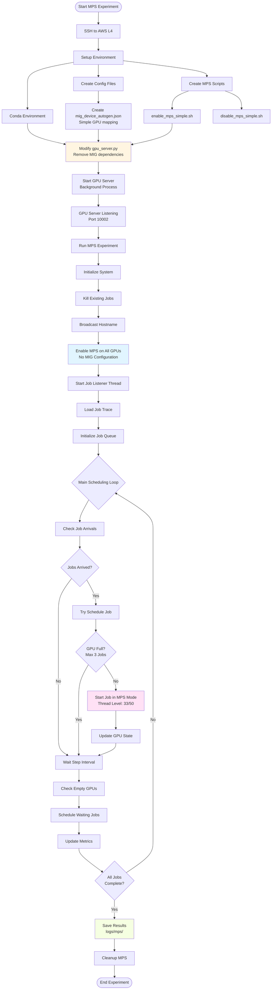

# MPS-Only Experiments on AWS L4 - Setup Plan

This guide provides a complete plan for running MPS (Multi-Process Service) experiments on an AWS L4 instance via SSH. This setup assumes **CUDA MPS only** (no MIG support).

## Prerequisites Checklist

Before starting, ensure you have:

- [ ] AWS L4 instance running (g4dn.xlarge or larger)
- [ ] SSH access to the instance
- [ ] Sudo/root access for GPU configuration
- [ ] NVIDIA drivers installed (check with `nvidia-smi`)
- [ ] CUDA toolkit installed
- [ ] Python 3.x and conda/miniconda installed
- [ ] Port 10002 available for TCP communication

## Step 1: Initial SSH Setup

```bash
# SSH into your AWS L4 instance
ssh -i your-key.pem ubuntu@your-instance-ip

# Verify GPU access
nvidia-smi

# Check CUDA MPS availability
which nvidia-cuda-mps-control
```

## Step 2: Clone and Prepare Repository

```bash
# Create directory structure
mkdir -p ~/GIT
cd ~/GIT

# Clone the repository (or upload via scp)
git clone <repository-url> socc22-miso
# OR if you need to upload:
# scp -r -i your-key.pem /local/path/to/socc22-miso ubuntu@your-instance-ip:~/GIT/

cd socc22-miso

# Verify structure
ls -la
```

## Step 3: Setup Python Environment

```bash
# Create conda environment
conda env create -f environment.yml

# Activate environment
conda activate <env-name>  # Check environment.yml for name

# Install any missing dependencies
pip install -r requirements.txt  # If exists
```

## Step 4: Create MPS-Only Configuration Files

Since AWS L4 doesn't support MIG, we need to create simplified configuration files.

### 4.1 Create Simplified Device Mapping (1 GPU)

Create `mig_device_autogen.json` for single GPU:

```bash
# First, find your hostname
HOSTNAME=$(hostname)
echo "Your hostname is: $HOSTNAME"

# Create device mapping file
cat > mig_device_autogen.json << EOF
{
  "$HOSTNAME": {
    "gpu0": {
      "0": ["0"]
    }
  }
}
EOF

# Verify it was created correctly
cat mig_device_autogen.json
```

### 4.2 Create Simplified MPS Enable Script

Create `enable_mps_simple.sh`:

```bash
cat > enable_mps_simple.sh << 'EOF'
#!/bin/bash

# Enable MPS for a GPU without MIG
# Usage: ./enable_mps_simple.sh <gpu_id>

GPU_ID=$1

# Set GPU to EXCLUSIVE_PROCESS mode
sudo nvidia-smi -i $GPU_ID -c EXCLUSIVE_PROCESS

# Create MPS directories
mkdir -p /tmp/mps_log/nvidia-mps$GPU_ID
mkdir -p /tmp/mps_log/nvidia-log$GPU_ID

# Set environment variables
export CUDA_VISIBLE_DEVICES=$GPU_ID
export CUDA_MPS_PIPE_DIRECTORY=/tmp/mps_log/nvidia-mps$GPU_ID
export CUDA_MPS_LOG_DIRECTORY=/tmp/mps_log/nvidia-log$GPU_ID

# Start MPS daemon
nvidia-cuda-mps-control -d

echo "MPS enabled for GPU $GPU_ID"
EOF

chmod +x enable_mps_simple.sh
```

### 4.3 Create Simplified MPS Disable Script

Create `disable_mps_simple.sh`:

```bash
cat > disable_mps_simple.sh << 'EOF'
#!/bin/bash

# Disable MPS for a GPU
# Usage: ./disable_mps_simple.sh <gpu_id>

GPU_ID=$1

# Quit MPS control
echo quit | nvidia-cuda-mps-control

# Reset GPU to default compute mode
sudo nvidia-smi -i $GPU_ID -c DEFAULT

echo "MPS disabled for GPU $GPU_ID"
EOF

chmod +x disable_mps_simple.sh
```

## Step 5: Modify GPU Server for MPS-Only

Create a modified `gpu_server_mps_only.py`:

```python
# Key modifications needed in gpu_server.py:
# 1. Remove MIG helper imports and calls
# 2. Simplify device mapping (use direct GPU IDs)
# 3. Modify mps_enable to use simple script
```

**Critical changes in `gpu_server.py` line 141-150:**

Replace:
```python
elif 'mps_enable' in data_str:
    gpuid = int(re.findall(r'\d+', data_str)[0])
    mig_helper.reset_mig(gpuid)  # REMOVE THIS
    mig_helper.create_ins(gpuid, '7g.40gb')  # REMOVE THIS
    current_partition[gpuid] = '0'
    device = cuda_devices[f'gpu{gpuid}'][current_partition[gpuid]][0]
    cmd = f'./enable_mps_on_mig.sh {device}'  # CHANGE THIS
```

With:
```python
elif 'mps_enable' in data_str:
    gpuid = int(re.findall(r'\d+', data_str)[0])
    current_partition[gpuid] = '0'
    device = str(gpuid)  # Direct GPU ID, no MIG mapping
    cmd = f'./enable_mps_simple.sh {gpuid}'
    p = subprocess.Popen([cmd], shell=True, cwd='/home/{}/GIT/socc22-miso'.format(user))
    p.wait()
    print(f'enabled MPS on GPU {gpuid}')
```

Also update device references in `mps_strt` and `mps_rsm`:
- Line 108: `device = str(gpuid)` instead of MIG lookup
- Line 128: `device = str(gpuid)` instead of MIG lookup

## Step 6: Prepare Workloads

```bash
# Download workload data (if needed)
# The repository expects workloads in shared memory or specific location

# Create scratch directory
mkdir -p /scratch/$USER/miso_logs
mkdir -p /tmp/mps_log

# If you have workload data, copy it:
# ./workloads/copy_memory.sh  # Modify paths if needed
```

## Step 7: Create MPS-Only Run Script

Create `run_mps_only.py`:

```python
#!/usr/bin/env python3
import argparse
import time
from pathlib import Path
from exp_mps import MPS

parser = argparse.ArgumentParser(description='MPS-only experiment')
parser.add_argument('--arrival', type=int, default=60, help='inter-arrival period')
parser.add_argument('--num_job', type=int, default=30, help='total number of jobs')
parser.add_argument('--num_gpu', type=int, default=1, help='total number of GPUs')
parser.add_argument('--seed', type=int, default=1, help='random seed')
parser.add_argument('--step', type=int, default=10, help='simulation step size')
parser.add_argument('--filler', action='store_true', default=False)
parser.add_argument('--flat_arrival', action='store_true', default=False)
parser.add_argument('--random_trace', action='store_true', default=False)
parser.add_argument('--mps_level', type=int, default=33, help='MPS thread percentage (33, 50, etc.)')
args = parser.parse_args()

# Create logs directory
Path('logs/mps').mkdir(parents=True, exist_ok=True)

# Get hostname dynamically or set manually
import socket
hostname = socket.gethostname()
physical_nodes = [hostname]  # Single node setup
print(f"Using hostname: {hostname}")

print('=' * 60)
print('Running MPS-Only Experiment')
print(f'Jobs: {args.num_job}, GPUs: {args.num_gpu}, MPS Level: {args.mps_level}')
print('=' * 60)

mps_exp = MPS(args, physical_nodes)
mps_exp.run(args, mps_lvl=args.mps_level)

print('Experiment completed!')
print(f'Results saved in: logs/mps/')
```

Make it executable:
```bash
chmod +x run_mps_only.py
```

## Step 8: Start GPU Server

In a **separate terminal** (or use `screen`/`tmux`):

```bash
# SSH into instance again in a new terminal, or use screen/tmux
ssh -i your-key.pem ubuntu@your-instance-ip

cd ~/GIT/socc22-miso
conda activate <env-name>

# Start GPU server
python gpu_server.py --node localhost --port 10002

# Keep this running in background
# Use screen: screen -S gpu_server
# Or tmux: tmux new -s gpu_server
```

## Step 9: Run MPS Experiment

In your main terminal:

```bash
cd ~/GIT/socc22-miso
conda activate <env-name>

# Run experiment (start with small test)
python run_mps_only.py \
    --arrival 100 \
    --num_gpu 1 \
    --num_job 5 \
    --random_trace \
    --seed 42 \
    --mps_level 33

# If test works, run full experiment
python run_mps_only.py \
    --arrival 100 \
    --num_gpu 1 \
    --num_job 30 \
    --random_trace \
    --seed 42 \
    --mps_level 33
```

## Step 10: Monitor Progress

```bash
# Watch experiment log
tail -f logs/experiment_mps.log

# Check GPU usage
watch -n 1 nvidia-smi

# Check running jobs
ps aux | grep python | grep train

# Check MPS status
nvidia-smi -q -d COMPUTE
```

## Expected Execution Flow



## Troubleshooting

### Issue: "GPU must be in 7g.40gb to start MPS"
**Solution**: The code checks for MIG partition. Modify `gpu_server.py` to skip this check for MPS-only mode.

### Issue: "Cannot find device in cuda_devices"
**Solution**: Ensure `mig_device_autogen.json` is correctly formatted and in the repo root.

### Issue: "Connection refused" on port 10002
**Solution**: 
- Check GPU server is running: `ps aux | grep gpu_server`
- Check firewall: `sudo ufw status`
- Verify port: `netstat -tuln | grep 10002`

### Issue: MPS not starting
**Solution**:
- Check sudo access: `sudo nvidia-smi`
- Verify MPS directories exist: `ls -la /tmp/mps_log/`
- Check MPS daemon: `ps aux | grep mps-control`

### Issue: Jobs not starting
**Solution**:
- Check workload files exist
- Verify job models JSON: `cat mps/scheduler/simulator/job_models.json`
- Check logs: `tail -f logs/experiment_mps.log`

## File Modifications Summary

Files that need modification for MPS-only:

1. **gpu_server.py**:
   - Remove `mig_helper` imports and calls
   - Simplify device mapping (use direct GPU IDs)
   - Update `mps_enable` to use `enable_mps_simple.sh`
   - Update `mps_strt` and `mps_rsm` device references

2. **New files to create**:
   - `mig_device_autogen.json` (simplified)
   - `enable_mps_simple.sh`
   - `disable_mps_simple.sh`
   - `run_mps_only.py`

3. **Files that should work as-is**:
   - `exp_mps.py` (already MPS-only, no MIG)
   - `controller_helper.py` (MPS functions work)
   - `tcp_interpreter.py` (MPS interpreter works)

## Quick Start Commands

```bash
# 1. Setup (one-time)
cd ~/GIT/socc22-miso
conda activate <env>
# Create config files (see Step 4)
# Modify gpu_server.py (see Step 5)

# 2. Start GPU server (in background)
screen -S gpu_server
python gpu_server.py --node localhost --port 10002
# Press Ctrl+A then D to detach

# 3. Run experiment
python run_mps_only.py --arrival 100 --num_gpu 1 --num_job 30 --random_trace

# 4. Monitor
tail -f logs/experiment_mps.log
# In another terminal: watch nvidia-smi
```

## Results Location

After completion, find results in:
- `logs/mps/JCT.json` - Job Completion Times
- `logs/mps/JRT.json` - Job Running Times  
- `logs/mps/QT.json` - Queue Times
- `logs/mps/migration.json` - Migration counts
- `logs/mps/active_jobs_per_gpu.json` - Active jobs over time
- `logs/mps/completion.json` - Completion status
- `logs/mps/progress.json` - Progress tracking
- `logs/experiment_mps.log` - Full experiment log

## Next Steps

1. Test with small job count first (`--num_job 5`)
2. Verify MPS is working: Check `nvidia-smi -q -d COMPUTE`
3. Run full experiment with desired parameters
4. Compare results across different MPS levels (33, 50, etc.)

## Questions to Clarify

Before proceeding, please confirm:

1. **Number of GPUs**: How many L4 GPUs does your instance have? (affects `--num_gpu`)
2. **Workload Data**: Do you have the workload data files, or do we need to generate/simulate them?
3. **Experiment Scale**: How many jobs do you want to run? (affects runtime)
4. **MPS Levels**: Which MPS thread percentages do you want to test? (33, 50, 14, etc.)
5. **Node Name**: What hostname does your AWS instance have? (for `physical_nodes`)

Let me know these details and I can provide more specific configuration!
