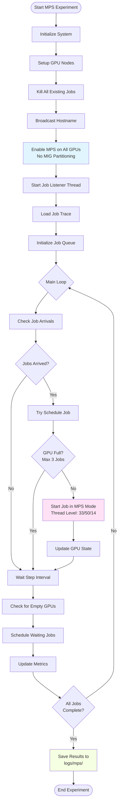

# Running Static, MPS, and MISO Experiments

This guide explains how to run only the Static, MPS, and MISO experiments individually, along with their expected execution flows.

## Quick Start

### Option 1: Create Individual Run Scripts

Create separate Python scripts for each experiment type:

#### Run Static Experiment Only

Create `run_static.py`:
```python
import argparse
from exp_static import Static

parser = argparse.ArgumentParser(description='Static MIG experiment')
parser.add_argument('--arrival', type=int, default=60)
parser.add_argument('--num_job', type=int, default=100)
parser.add_argument('--num_gpu', type=int, default=8)
parser.add_argument('--seed', type=int, default=1)
parser.add_argument('--step', type=int, default=10)
parser.add_argument('--filler', action='store_true', default=False)
parser.add_argument('--flat_arrival', action='store_true', default=False)
parser.add_argument('--random_trace', action='store_true', default=False)
args = parser.parse_args()

from pathlib import Path
Path('logs/static').mkdir(parents=True, exist_ok=True)

physical_nodes = ['d3104', 'd3105']  # Update with your node names

print('Running Static Experiment')
static_exp = Static(args, physical_nodes)
static_exp.run(args, slice_code=6, partition=[3,2,2])  # Default: code 6, partition [3,2,2]
```

Run with:
```bash
python run_static.py --arrival 100 --num_gpu 4 --num_job 30 --random_trace
```

#### Run MPS Experiment Only

Create `run_mps.py`:
```python
import argparse
from exp_mps import MPS

parser = argparse.ArgumentParser(description='MPS experiment')
parser.add_argument('--arrival', type=int, default=60)
parser.add_argument('--num_job', type=int, default=100)
parser.add_argument('--num_gpu', type=int, default=8)
parser.add_argument('--seed', type=int, default=1)
parser.add_argument('--step', type=int, default=10)
parser.add_argument('--filler', action='store_true', default=False)
parser.add_argument('--flat_arrival', action='store_true', default=False)
parser.add_argument('--random_trace', action='store_true', default=False)
args = parser.parse_args()

from pathlib import Path
Path('logs/mps').mkdir(parents=True, exist_ok=True)

physical_nodes = ['d3104', 'd3105']  # Update with your node names

print('Running MPS Experiment')
mps_exp = MPS(args, physical_nodes)
mps_exp.run(args, mps_lvl=33)  # Default: MPS level 33 (can be 50, 14, etc.)
```

Run with:
```bash
python run_mps.py --arrival 100 --num_gpu 4 --num_job 30 --random_trace
```

#### Run MISO Experiment Only

Create `run_miso.py`:
```python
import argparse
from exp_miso import MISO

parser = argparse.ArgumentParser(description='MISO experiment')
parser.add_argument('--arrival', type=int, default=60)
parser.add_argument('--num_job', type=int, default=100)
parser.add_argument('--num_gpu', type=int, default=8)
parser.add_argument('--seed', type=int, default=1)
parser.add_argument('--error_mean', type=float, default=0.016)
parser.add_argument('--error_std', type=float, default=0.0032)
parser.add_argument('--step', type=int, default=10)
parser.add_argument('--filler', action='store_true', default=False)
parser.add_argument('--flat_arrival', action='store_true', default=False)
parser.add_argument('--random_trace', action='store_true', default=False)
args = parser.parse_args()

from pathlib import Path
Path('logs/miso').mkdir(parents=True, exist_ok=True)

physical_nodes = ['d3104', 'd3105']  # Update with your node names

print('Running MISO Experiment')
miso_exp = MISO(args, physical_nodes)
miso_exp.run(args)
```

Run with:
```bash
python run_miso.py --arrival 100 --num_gpu 4 --num_job 30 --random_trace
```

### Option 2: Modify run.py

Alternatively, comment out unwanted experiments in `run.py`:

```python
# Comment out Full and Oracle
# print('Full')
# full_exp = Experiment(args, physical_nodes)
# full_exp.run(args)
# time.sleep(300)

print('Static')
static_exp = Static(args, physical_nodes)
static_exp.run(args)

print('MISO')
miso_exp = MISO(args, physical_nodes)
miso_exp.run(args)
time.sleep(300)

print('MPS')
mps_exp = MPS(args, physical_nodes)
mps_exp.run(args)
```

## Execution Flow Diagrams

### Static Experiment Execution Flow

```mermaid
graph TB
    Start([Start Static Experiment]) --> Init[Initialize System]
    
    Init --> SetupGPU[Setup GPU Nodes]
    SetupGPU --> KillJobs[Kill All Existing Jobs]
    KillJobs --> Broadcast[Broadcast Hostname]
    Broadcast --> ConfigMIG[Configure MIG Partition<br/>Code: 6, Partition: 3-2-2]
    
    ConfigMIG --> StartListener[Start Job Listener Thread]
    StartListener --> LoadTrace[Load Job Trace]
    LoadTrace --> InitQueue[Initialize Job Queue]
    
    InitQueue --> MainLoop{Main Loop}
    
    MainLoop --> CheckArrival[Check Job Arrivals]
    CheckArrival --> HasArrivals{Jobs Arrived?}
    
    HasArrivals -->|Yes| TrySchedule[Try Schedule Job]
    HasArrivals -->|No| WaitStep[Wait Step Interval]
    
    TrySchedule --> FindSlice[Find Available Slice<br/>in Fixed Partition]
    FindSlice --> SliceFound{Slice Found?}
    
    SliceFound -->|Yes| AssignJob[Assign Job to Slice]
    SliceFound -->|No| WaitStep
    
    AssignJob --> StartJob[Start Job on GPU Slice]
    StartJob --> UpdateState[Update GPU State]
    UpdateState --> WaitStep
    
    WaitStep --> CheckEmpty[Check for Empty GPUs]
    CheckEmpty --> CheckIdle[Check for Idle Slices]
    
    CheckIdle --> HasIdle{Idle Slices?}
    HasIdle -->|Yes| Promote[Promote Jobs<br/>to Larger Slices]
    HasIdle -->|No| UpdateMetrics
    
    Promote --> Checkpoint[Checkpoint Jobs]
    Checkpoint --> Resume[Resume on New Slice]
    Resume --> UpdateMetrics[Update Metrics]
    
    UpdateMetrics --> CheckComplete{All Jobs<br/>Complete?}
    CheckComplete -->|No| MainLoop
    CheckComplete -->|Yes| SaveResults[Save Results to<br/>logs/static/]
    
    SaveResults --> End([End Experiment])
    
    style ConfigMIG fill:#e1f5ff
    style Promote fill:#ffe1f5
    style SaveResults fill:#f5ffe1
```



### MPS Experiment Execution Flow



### MISO Experiment Execution Flow

```mermaid
graph TB
    Start([Start MISO Experiment]) --> Init[Initialize System]
    
    Init --> SetupGPU[Setup GPU Nodes]
    SetupGPU --> KillJobs[Kill All Existing Jobs]
    KillJobs --> Broadcast[Broadcast Hostname]
    Broadcast --> InitMIG[Initialize MIG<br/>All GPUs: Full 7g.40gb]
    
    InitMIG --> StartListener[Start Job Listener Thread]
    StartListener --> LoadTrace[Load Job Trace]
    LoadTrace --> InitQueue[Initialize Job Queue]
    InitQueue --> LoadPerf[Load Performance Predictions]
    
    LoadPerf --> MainLoop{Main Loop}
    
    MainLoop --> CheckArrival[Check Job Arrivals]
    CheckArrival --> HasArrivals{Jobs Arrived?}
    
    HasArrivals -->|Yes| TrySchedule[Try Schedule Job]
    HasArrivals -->|No| CheckMPS[Check MPS Profiling<br/>Completion]
    
    TrySchedule --> OptimizePartition[Optimize MIG Partition<br/>Using Predictions]
    OptimizePartition --> SingleJob{Single Job?}
    
    SingleJob -->|Yes| ConfigFull[Configure Full GPU]
    SingleJob -->|No| CheckpointOld[Checkpoint Existing Jobs]
    
    ConfigFull --> StartJob[Start Job on GPU]
    CheckpointOld --> StartMPSProf[Start MPS Profiling Phase<br/>30 seconds]
    
    StartMPSProf --> MPSRunning[MPS Profiling Running]
    StartJob --> UpdateState[Update GPU State]
    
    MPSRunning --> CheckMPS
    CheckMPS --> MPSDone{MPS Done?}
    
    MPSDone -->|Yes| CheckpointMPS[Checkpoint MPS Jobs]
    MPSDone -->|No| WaitStep
    
    CheckpointMPS --> ConfigMIG[Configure Optimal MIG<br/>Based on Profiling]
    ConfigMIG --> ResumeJobs[Resume All Jobs<br/>on MIG Slices]
    ResumeJobs --> UpdateState
    
    UpdateState --> WaitStep[Wait Step Interval]
    WaitStep --> CheckEmpty[Check for Empty GPUs]
    
    CheckEmpty --> HasIdle{Idle GPU?}
    HasIdle -->|Yes| Repartition[Re-partition GPU<br/>Optimize for Remaining Jobs]
    HasIdle -->|No| UpdateMetrics
    
    Repartition --> CheckpointRepart[Checkpoint Jobs]
    CheckpointRepart --> ConfigNewMIG[Configure New MIG]
    ConfigNewMIG --> ResumeRepart[Resume Jobs]
    ResumeRepart --> UpdateMetrics[Update Metrics]
    
    UpdateMetrics --> CheckComplete{All Jobs<br/>Complete?}
    CheckComplete -->|No| MainLoop
    CheckComplete -->|Yes| SaveResults[Save Results to<br/>logs/miso/]
    
    SaveResults --> End([End Experiment])
    
    style StartMPSProf fill:#e1f5ff
    style OptimizePartition fill:#ffe1f5
    style Repartition fill:#fff5e1
    style SaveResults fill:#f5ffe1
```



## Experiment Comparison

| Feature | Static | MPS | MISO |
|---------|--------|-----|------|
| **MIG Partitioning** | Fixed (3-2-2) | None | Dynamic |
| **MPS Profiling** | No | No | Yes (30s) |
| **Re-partitioning** | No (slice promotion only) | N/A | Yes |
| **Max Jobs/GPU** | 3 (fixed slices) | 3 | Variable |
| **Checkpoint/Resume** | Yes (for promotion) | No | Yes (for re-partition) |
| **Performance Prediction** | No | No | Yes (with error) |
| **GPU Configuration** | Static MIG | MPS only | Dynamic MIG |

## Common Parameters

All three experiments support these common parameters:

- `--arrival`: Inter-arrival period in seconds (default: 60)
- `--num_job`: Total number of jobs (default: 100)
- `--num_gpu`: Total number of GPUs (default: 8)
- `--seed`: Random seed (default: 1)
- `--step`: Simulation step size in seconds (default: 10)
- `--filler`: Make first 5% of jobs as filler jobs
- `--flat_arrival`: Flat arrival distribution
- `--random_trace`: Randomly sample jobs from trace

### Static-Specific Parameters

- `slice_code`: MIG partition code (default: 6)
- `partition`: Partition configuration (default: [3,2,2])

### MPS-Specific Parameters

- `mps_lvl`: MPS thread percentage level (default: 33, options: 50, 14, etc.)

### MISO-Specific Parameters

- `--error_mean`: Mean prediction error (default: 0.016)
- `--error_std`: Prediction error std dev (default: 0.0032)

## Example Commands

### Run All Three Experiments Sequentially

```bash
# Static
python run_static.py --arrival 100 --num_gpu 4 --num_job 30 --random_trace --seed 42

# Wait 5 minutes between experiments
sleep 300

# MISO
python run_miso.py --arrival 100 --num_gpu 4 --num_job 30 --random_trace --seed 42 --error_mean 0.016

# Wait 5 minutes
sleep 300

# MPS
python run_mps.py --arrival 100 --num_gpu 4 --num_job 30 --random_trace --seed 42
```

### Run with Different Configurations

```bash
# Static with custom partition
python run_static.py --arrival 60 --num_gpu 8 --num_job 50 --seed 1

# MPS with different thread level
python run_mps.py --arrival 60 --num_gpu 8 --num_job 50 --seed 1
# Then modify run_mps.py to use mps_lvl=50 instead of 33

# MISO with higher prediction error
python run_miso.py --arrival 60 --num_gpu 8 --num_job 50 --seed 1 --error_mean 0.02 --error_std 0.004
```

## Output Locations

All experiments save results in their respective directories:

- **Static**: `logs/static/`
  - JCT.json, JRT.json, QT.json
  - migration.json, active_jobs_per_gpu.json
  - completion.json, progress.json
  - ckpt_dict.json, ckpt_ovhd.json
  - overall_rate.json

- **MPS**: `logs/mps/`
  - Same as Static (except no checkpoint overhead details)

- **MISO**: `logs/miso/`
  - All Static metrics plus:
  - mps_spent_time.json
  - mps_compl_batch.json

## Prerequisites

Before running experiments:

1. **Setup GPU Nodes**: Ensure `gpu_server.py` is running on each GPU node
2. **Configure MIG**: Run `python mig_helper.py --init` on each GPU node
3. **Export Device UUIDs**: Run `python export_cuda_device_auto.py`
4. **Update Node Names**: Modify `physical_nodes` list in scripts to match your system
5. **Load Workloads**: Ensure workload data is in shared memory (run `workloads/copy_memory.sh`)

## Troubleshooting

- **Connection errors**: Ensure GPU nodes are accessible and `gpu_server.py` is running
- **MIG errors**: Verify MIG is enabled and properly configured
- **Job failures**: Check logs in `logs/{experiment_type}/experiment_{type}.log`
- **Performance issues**: Adjust `--step` parameter for faster/slower simulation

## Notes

- Each experiment runs until all jobs complete or timeout (18-36 hours)
- Experiments can be run independently or sequentially
- Use same `--seed` for fair comparison across experiments
- Results are saved automatically when experiments complete

