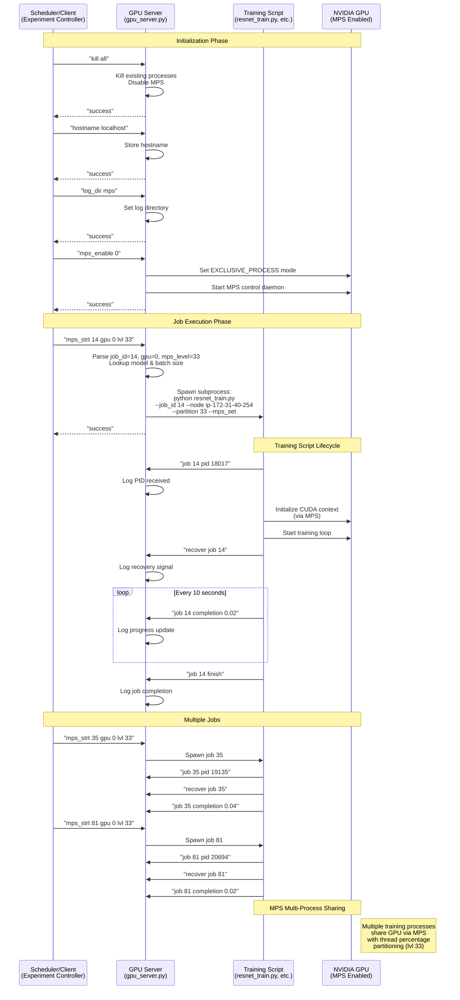

# MPS GPU Server Architecture

This document explains the three-process interaction model for the MPS (Multi-Process Service) GPU server system.

## Overview

The system consists of three main components that communicate via TCP sockets:

1. **Scheduler/Client** - Sends job scheduling commands
2. **GPU Server** - Receives commands and spawns training jobs
3. **Training Scripts** - Execute ML training and report status back

## Architecture Diagram



## Component Details

### 1. Scheduler/Client (Experiment Controller)

**Role**: Orchestrates the experiment by sending commands to GPU servers

**Key Commands Sent**:
- `kill all` - Cleanup existing processes
- `hostname <name>` - Set hostname for training scripts
- `log_dir <dir>` - Set log directory path
- `mps_enable <gpu_id>` - Enable MPS on specified GPU
- `mps_strt <job_id> gpu <gpu_id> lvl <mps_level>` - Start a training job

**Location**: `exp_mps.py`, `controller_helper.py`

### 2. GPU Server (gpu_server.py)

**Role**: TCP server that receives commands and spawns training processes

**Key Responsibilities**:
- Listens on TCP port (default 10002)
- Parses incoming commands
- Spawns training script subprocesses
- Logs all received messages
- Manages MPS daemon lifecycle

**Command Processing**:
- `mps_strt`: Extracts job_id, gpu_id, mps_level
- Looks up model type and batch size from config files
- Constructs training command with CUDA_VISIBLE_DEVICES
- Spawns subprocess with stdout/stderr redirected to log files
- Returns "success" to client

**Port**: 10002 (configurable via `--port`)

### 3. Training Scripts (resnet_train.py, etc.)

**Role**: Execute ML training and report status back to GPU server

**Key Behaviors**:
1. **On Start**: Immediately sends `job <job_id> pid <pid>` to register PID
2. **After First Batch**: Sends `recover job <job_id>` to signal ready
3. **Progress Updates**: Every 10 seconds, sends `job <job_id> completion <progress>`
4. **On Finish**: Sends `job <job_id> finish` before exiting

**MPS Integration**:
- Sets `CUDA_MPS_ACTIVE_THREAD_PERCENTAGE` environment variable
- Connects to MPS daemon for GPU access
- Multiple jobs share GPU with thread percentage partitioning

**Location**: `workloads/*_train.py`

## Communication Flow

### TCP Socket Protocol

All communication uses TCP sockets with simple string messages:

**Message Format**: Plain text strings up to 40 bytes
**Response**: `"success"` (binary encoded)

**Example Messages**:
```
"mps_strt 14 gpu 0 lvl 33"
"job 14 pid 18017"
"recover job 14"
"job 14 completion 0.02"
"job 14 finish"
```

### Connection Handling

- GPU server accepts multiple connections sequentially
- Each connection can send multiple messages
- Connection closes after message exchange
- Training scripts open new connections for each status update

## MPS (Multi-Process Service) Details

**Purpose**: Allow multiple CUDA processes to share a single GPU context

**Configuration**:
- GPU set to `EXCLUSIVE_PROCESS` compute mode
- MPS control daemon manages shared context
- Thread percentage (`lvl 33` = 33%) controls resource allocation per job

**Benefits**:
- Multiple jobs can run concurrently on same GPU
- Fine-grained resource partitioning
- Transparent to CUDA applications

## File Locations

- **GPU Server**: `gpu_server.py`
- **Training Scripts**: `workloads/*_train.py`
- **Scheduler**: `exp_mps.py`, `controller_helper.py`
- **Signal Helper**: `workloads/send_signal.py`
- **MPS Scripts**: `enable_mps_simple.sh`, `disable_mps.sh`
- **Logs**: `/scratch/{user}/miso_logs/{log_dir}/job{id}_start.{out,err}`

## Error Handling

- **Connection Errors**: Training scripts catch `socket.gaierror` if server hostname invalid
- **MPS Daemon**: "Cannot find MPS control daemon process" warning if daemon not running (non-fatal)
- **Process Spawning**: Errors logged to `job{id}_start.err` files

